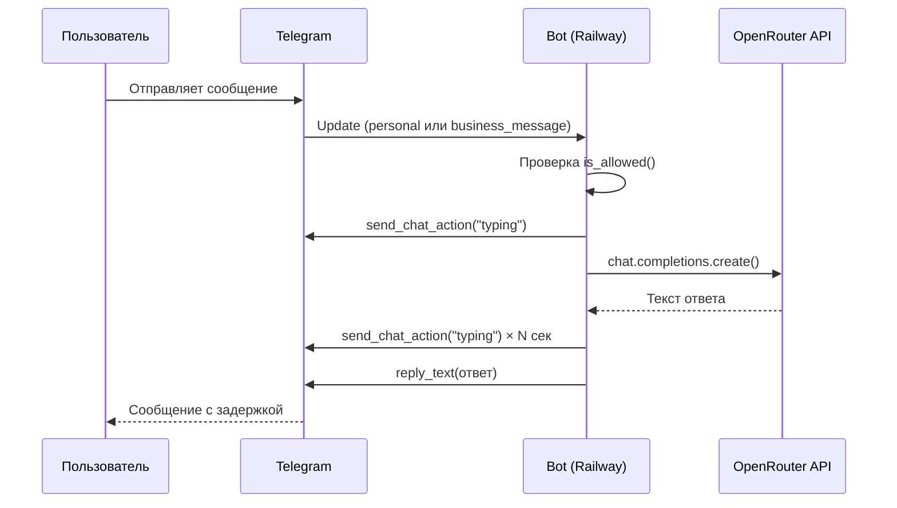
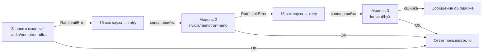
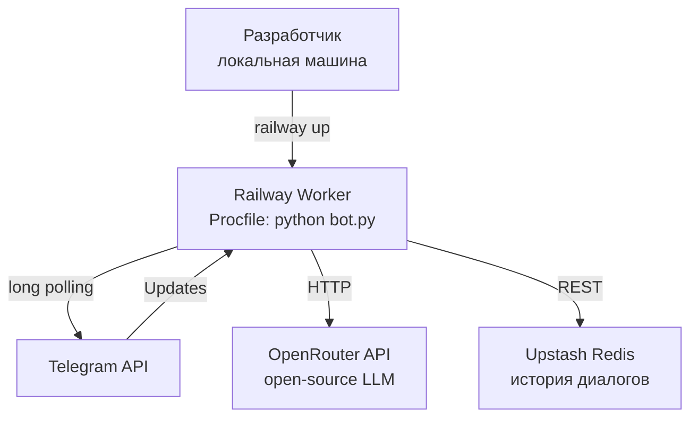

# Telegram Secretary Bot

Бот-секретарь для Telegram, который автоматически отвечает на сообщения через AI от вашего имени. Персонаж, стиль и тематика задаются через промт в `config.toml`. Поддерживает обычные личные сообщения и **Telegram Business / автоматизацию чатов**. Имитирует живого человека: показывает индикатор набора текста с реалистичной задержкой.

## Возможности

- Отвечает от вашего имени в заданном стиле (настраивается через промт в `config.toml`)
- Поддерживает Telegram Business (автоматизация чатов)
- Имитирует набор текста с реалистичной задержкой (60 симв/сек ±20%)
- Помнит историю диалога (последние 40 сообщений на пользователя, хранится в Redis)
- Фильтрует доступ по username или Telegram ID (или разрешает всем через `*`)
- Цепочка fallback-моделей с retry при rate limit

## Архитектура

### Поток сообщения



### Fallback-цепочка моделей



### Инфраструктура



## Быстрый старт

### 1. Зависимости

```bash
python -m venv .venv
source .venv/bin/activate
pip install -r requirements.txt
```

### 2. Переменные окружения

Создайте `.env` (не коммитить) или задайте в Railway:

| Переменная | Обязательна | Описание |
|---|---|---|
| `TELEGRAM_TOKEN` | ✅ | Токен бота от [@BotFather](https://t.me/BotFather) |
| `OPENROUTER_API_KEY` | ✅ | Ключ от [openrouter.ai](https://openrouter.ai/keys) |
| `UPSTASH_REDIS_REST_URL` | ✅ | URL базы из [console.upstash.com](https://console.upstash.com) |
| `UPSTASH_REDIS_REST_TOKEN` | ✅ | Token базы из [console.upstash.com](https://console.upstash.com) |
| `ALLOWED_USERNAMES` | — | Telegram username через запятую (или `*` для всех) |
| `ALLOWED_USER_IDS` | — | Telegram ID через запятую |

Если оба поля пусты — бот никому не отвечает. Укажите хотя бы одно.

### 3. Запуск локально

```bash
export TELEGRAM_TOKEN=...
export OPENROUTER_API_KEY=...
export ALLOWED_USERNAMES="*"
python bot.py
```

## Деплой на Railway

```bash
# Первый деплой
railway login
railway init
railway up --detach

# Последующие обновления
railway up --detach --service <имя-сервиса>
```

В Railway Dashboard → сервис → Variables добавьте все переменные из таблицы выше.

Тип сервиса: **Worker** (не Web Service). В `Procfile` уже прописан нужный запуск.

## Upstash Redis (история диалогов)

История диалогов хранится в Upstash Redis и переживает рестарты Railway.

1. Зарегистрируйся на [upstash.com](https://upstash.com) (бесплатно, без карты)
2. Создай базу: **Create Database** → регион ближайший → тип **Regional**
3. Скопируй `UPSTASH_REDIS_REST_URL` и `UPSTASH_REDIS_REST_TOKEN` из вкладки **REST API**
4. Добавь оба значения в Railway Variables

Бесплатный план: 10 000 команд/день, 256 MB — для одного бота хватит с запасом.

## Telegram Business (автоматизация чатов)

1. Нужна подписка **Telegram Premium**
2. Настройки → Telegram Business → Чат-боты → выбрать бота
3. Бот начнёт отвечать на входящие сообщения от вашего имени

## Тесты

```bash
pytest tests/ -v
```

## Конфигурация (`config.toml`)

Все настройки, не являющиеся секретами, хранятся в `config.toml`:

```toml
[bot]
chars_per_second = 60          # скорость имитации набора текста
max_history = 40               # макс. сообщений в истории диалога на пользователя

[models]
fallback = [                   # модели OpenRouter в порядке приоритета
    "nvidia/nemotron-3-ultra-550b-a55b:free",
    ...
]

[prompt]
system = """
Ты отвечаешь от имени Senior Android-разработчика...
"""
```

Чтобы изменить промт, модели или лимит истории — редактируйте `config.toml` и передеплойте. Секреты (`TELEGRAM_TOKEN`, `OPENROUTER_API_KEY`) остаются в переменных окружения.

## Модели

Используются бесплатные модели OpenRouter. Список доступных моделей может меняться — актуальные можно проверить через [openrouter.ai/models](https://openrouter.ai/models?supported_parameters=free).

Текущий fallback-список в `config.toml`:
```
nvidia/nemotron-3-ultra-550b-a55b:free
nvidia/nemotron-3-nano-omni-30b-a3b-reasoning:free
tencent/hy3:free
```

## Структура проекта

```
telegram-secretary/
├── bot.py              # Основной код бота
├── config.toml         # Промт, модели, настройки
├── Procfile            # Railway: worker: python bot.py
├── requirements.txt    # Зависимости
├── pyproject.toml      # Настройки pytest
└── tests/
    └── test_bot.py     # Юнит-тесты (5 тестов)
```
